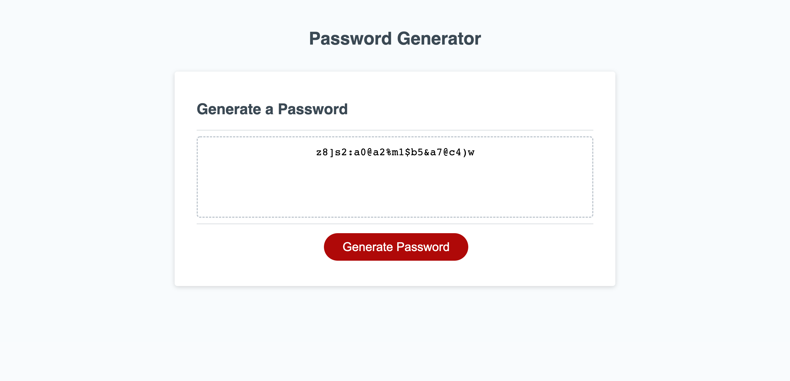

# Password-Generator

This is an Password Generator that has various prompts that ultimately generates a random password according to users selections.

## Objectives

1. Ask user for password criteria. will password contain Uppercase letters, Lower casse letters, Numbers, Symbols
2. Validate the input
3. Generate password based on criteria
4. Display password to the page.

## Links to git hub account and final page

- <https://github.com/jayBassMan/Password-Generator>

- <https://jaybassman.github.io/Password-Generator/>

## Screenshot of final page

## Contributions

 Kelly Jefferies
 Phil loy
